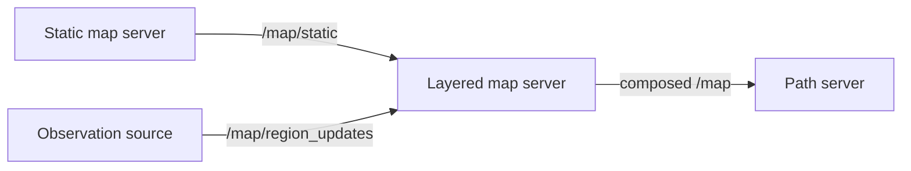

[Draft for Discourse]

# Layered Global Occupancy Map

This post describes the first implemented slice of a layered global occupancy map for the next generation Open-RMF prototype.

The goal of this slice is to let temporary local observations affect the global planning map without changing the path server interface. The path server can continue to consume a normal `nav_msgs/OccupancyGrid` from `/map`, while a new map server composes that grid from a static map and active observation layers.

# Quick Summary

* Robots and perception sources can publish sparse 2D region updates with a time-to-live (TTL)
* A central layered map server composes a static map with active dynamic observations
* Observations from multiple sources are stitched into one composed global grid
* The composed output is published as `nav_msgs/OccupancyGrid` on `/map`
* The observation messages live in `rmf_layered_map_msgs`, leaving `rmf_prototype_msgs` unchanged
* The first implementation is a Rust package named `rmf_layered_map_server` under `map_server/`

# Background

The static map support in the prototype gives the path server a useful baseline: it already consumes a `nav_msgs/OccupancyGrid` from `/map` and can plan around occupied cells. This implementation preserves that contract. Instead of teaching the planner about every possible observation source, the layered map server publishes one composed `/map`.

Local observations from robots are different from static map data. They may describe temporary objects such as pedestrians, carts, doors held open, or equipment left in the path. For that reason the central map treats robot observations as dynamic layers that expire unless they are refreshed.

This implementation builds on the existing static map behavior.

# Interface Topology Overview



The layered map server owns the composed `/map` topic. When it is present, any static map publisher should be remapped to `/map/static`.

The path server continues to subscribe to `/map`. It does not subscribe directly to local robot observations. This keeps map composition independent from multi-agent planning and allows alternative map server implementations to be swapped in later.

Each observation stream publishes updates with a unique `source_id`, such as `robot_1/local_costmap` or `robot_2/lidar_obstacles`. The layered map server tracks these sources independently but composes their active observations into a single `OccupancyGrid`.

# Observation Topics

* `/map/region_updates` - [`MapRegionUpdate.msg`](../rmf_layered_map_msgs/msg/MapRegionUpdate.msg): Dynamic local observation updates

The topic is treated as an event stream. Updates are not latched because expired observations should not be replayed to a restarted map server as if they were current.

# Messages

## `MapObservationSource`

[`MapObservationSource.msg`](../rmf_layered_map_msgs/msg/MapObservationSource.msg) describes where an observation came from.

Important fields:

* `source_id`: stable source identifier, usually the robot namespace plus the local source name
* `robot_name`: robot that produced the observation, if the source is mounted on a robot. This can be empty for fixed sensors or synthetic layers
* `map_name`: map or level that the observation belongs to
* `frame_id`: coordinate frame for the regions
* `stamp`: time when the observation snapshot was produced
* `default_ttl`: fallback TTL for updates from this source

## `MapRegionUpdate`

[`MapRegionUpdate.msg`](../rmf_layered_map_msgs/msg/MapRegionUpdate.msg) describes one sparse update from a local observation source.

Update types:

* `UPDATE_OBSTACLE`: regions are temporary occupied space
* `UPDATE_CLEAR`: regions are temporary free space
* `UPDATE_RESET`: previous observations from the same source should be removed

The first implementation uses `rmf_prototype_msgs/Region` for 2D geometry. This keeps the message sparse and lets the central map server rasterize regions into its composed `OccupancyGrid`.

The map observation messages live in a dedicated `rmf_layered_map_msgs` package. This keeps `rmf_prototype_msgs` as a stable public API surface while allowing the layered-map interface to evolve in its own package.

# Layered Map Server

The first server implementation is a Rust package named `rmf_layered_map_server` under the `map_server/` directory.

Inputs:

* `/map/static`: `nav_msgs/OccupancyGrid`, transient local, reliable
* `/map/region_updates`: `rmf_layered_map_msgs/MapRegionUpdate`, reliable

Output:

* `/map`: composed `nav_msgs/OccupancyGrid`, transient local, reliable

The server keeps the static grid separate from active dynamic observations:

```text
LayeredMap
  static_grid: OccupancyGrid
  dynamic_observations: Vec<DynamicObservation>
  revision: u64

DynamicObservation
  source_id: String
  map_name: String
  update_type: obstacle | clear
  occupancy_value: i8
  regions: Vec<Region>
  expires_at: Time
```

Composition rules:

1. Start from the latest static grid.
2. Drop expired dynamic observations before composing.
3. Rasterize active clear regions to free space.
4. Rasterize active obstacle regions to occupied space.
5. Active obstacle observations win over active clear observations for the same cell.
6. Unknown static cells stay unknown unless an active clear or obstacle observation covers them.

`UPDATE_RESET` removes observations from the same source and map without disturbing observations from other robots. For example, if `robot_1/local_costmap` resets its obstacle layer, active observations from `robot_2/local_costmap` remain in the composed grid.

The server does not use the full `-/errors` component pattern from the broader topic taxonomy. For transient observations, TTL expiration is the primary recovery mechanism.

# Implemented Test Coverage

The Rust tests cover:

* composing obstacle regions over a static map
* point regions with non-zero map origins and non-1.0 resolutions
* polygon regions, out-of-bounds regions, and malformed region point arrays
* pruning expired observations by TTL
* active obstacle observations winning over active clear observations
* reset updates removing observations from the same source and map
* multiple robot sources being stitched into one composed grid

The `rmf_layered_map_server_demo` package includes a small publisher that sends a static map and a temporary obstacle update. Its launch file starts the layered map server and RViz on `/map`, so developers can see the dynamic layer appear and decay without needing the full Nav2 or replanning loop.

The `rmf_layered_map_server_test` package adds a launch test for the ROS topic contract: `/map/static` and `/map/region_updates` are consumed, `/map` is published, reset updates remove active observations, and obstacles are removed after TTL expiry.
