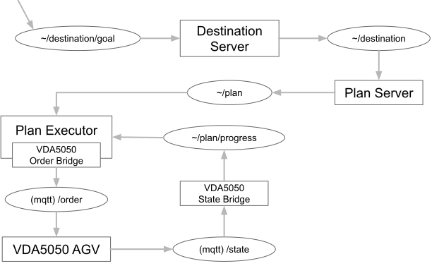
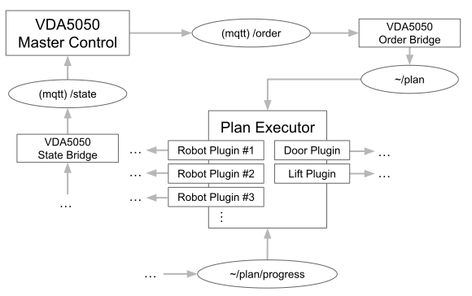
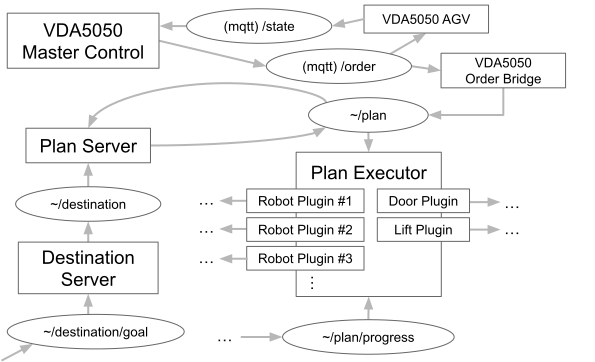
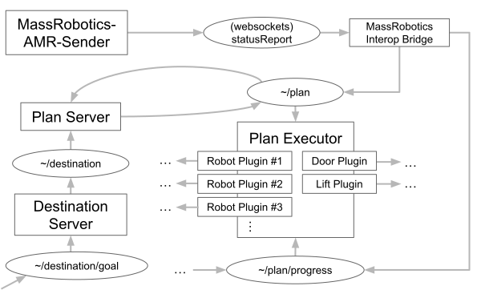
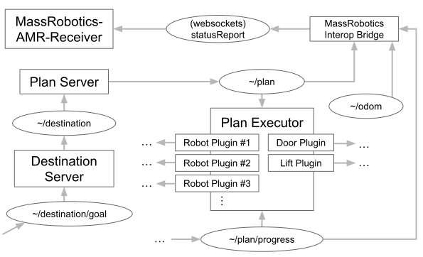
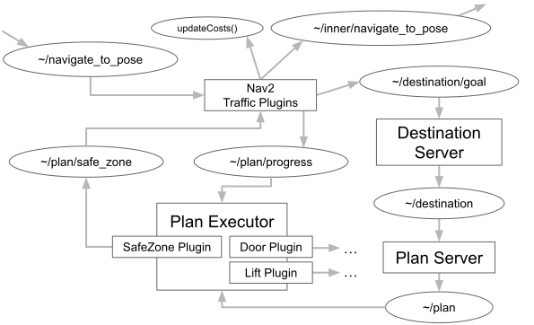

# Quick Summary

* Proposing topics and messages for next generation Open-RMF traffic management interfaces
* Modular design allows custom and interchangeable implementations of dispatching, planning, and execution capabilities
* Trying to align with Nav2, VDA5050, MassRobotics AMR Interop, and any other similar standards
* Want an easy integration experience for any other mobile robot APIs, whether open specifications or proprietary
* Trying to be suitable for both AGVs and AMRs while still getting the best out of both types of mobile robots
* Looking for feedback and input

# Intro

This post is meant to kick off a discussion of how to define ROS interfaces for the traffic management capabilities of the "next generation" of the Open-RMF project. The ideas here will follow patterns laid out in [an earlier post](https://discourse.ros.org/t/taxonomy-of-interfaces-for-the-next-generation/44310) about the taxonomy of interfaces.

We hope to achieve the following objectives through this design process:
* Have interfaces that are well-aligned with other mobile robot interoperability standards like VDA5050 and MassRobotics AMR Interop
  * Each of these standards should map cleanly to a certain subset of the interfaces that we define
  * We will provide first-class bridges out of the box for each of these open standards
* Have strong integration with Nav2
  * The right choice of Nav2 plugins should be able to yield the full benefit of Nav2's local and global planning capabilities **and** the full benefit of Open-RMF's traffic and infrastructure management capabilities, with no conflicts between the two
* Support both AGVs and AMRs in a way that exercises the full value of both types of robots
* Allow traffic and infrastructure management to be fully modular. We expect each of the following capabilities to be provided by modules that can be implemented independently and custom-made based on the needs of a deployment:
  * Dispatching goals to robots
  * Reserving destinations for robots to avoid conflicts between goals
  * Generating conflict-free multi-agent traffic plans to bring robots from their current locations to their goals
  * Executing a plan, including interfacing with infrastructure as needed
* Provide commercial-friendly open source reference implementations of every capability

In this post we'll be laying out some ideas for how we hope to achieve such a design. We are eager to get feedback and input from the community about whether these interfaces fit your needs, and/or how we can improve or expand on them to close any remaining gaps.

This post is specifically focused on traffic management capabilities and does not cover task management. A proposal for task management will be covered in a future post.

# Interface Topology Overview

The key to separating concerns between the four modules mentioned above is to define ROS interfaces that are general enough to work across all the different types of robots and deployments that we are trying to target, while still being specific enough to set clear expectations for how the messages should be handled by each module.

Throughout this post we will be referring to messages that are defined in the [prototyping](https://github.com/open-rmf/next_gen_prototype) repository.

For the overall traffic management system, we break the topics down into two base topics, each with a variety of optional components depending on the needs of your integration:
* `~/destination`
* `~/plan`

We will be following the patterns laid out [in this post](https://discourse.ros.org/t/taxonomy-of-interfaces-for-the-next-generation/44310) in the following ways:
* Each individual robot will prefix these base topics with its own unique namespace(s)
* We will define component topics that can be appended to each base topic to opt into various optional capabilities
* The `/destination/discovery` and `/plan/discovery` topics will advertise what robots are interacting with the system and how

### Topic collision

Since the topics names `destination` and `plan` are broad enough that they may conflict with pre-existing topic names for some systems, system integrators are allowed to define a namespace to attach directly in front of these topic names. For example you might instead use `/traffic/destination` and `/traffic/plan`. In this case, the agent-specific namespace should go in front of this combined topic name, e.g. `delivery_robot_1` would own the topic `/delivery_robot_1/traffic/destination`.

## Destination topics

* `~/destination` (Mandatory) - [`Destination.msg`](https://github.com/open-rmf/next_gen_prototype/blob/main/rmf_prototype_msgs/msg/Destination.msg): The current destination of the robot
* `~/destination/error` (Mandatory) - [`DestinationError.msg`](https://github.com/open-rmf/next_gen_prototype/blob/main/rmf_prototype_msgs/msg/DestinationError.msg): An error occurred while trying to generate a plan for the destination
* `~/destination/session_refresh` (Mandatory) - [`SessionRefresh.msg`](https://github.com/open-rmf/next_gen_prototype/blob/main/rmf_prototype_msgs/msg/SessionRefresh.msg): Ask for a new session to be started for the destination
* `/destination/discovery` (Recommended) - [`ParticipantList.msg`](https://github.com/open-rmf/next_gen_prototype/blob/main/rmf_prototype_msgs/msg/ParticipantList.msg): Find the namespaces participating in this topic
* `~/destination/goal` (Goal Component) - [`DestinationGoal.msg`](https://github.com/open-rmf/next_gen_prototype/blob/main/rmf_prototype_msgs/msg/DestinationGoal.msg): A choice of destinations for the robot to reach
* `~/destination/goal/error` (Goal Component) - [`DestinationError.msg`](https://github.com/open-rmf/next_gen_prototype/blob/main/rmf_prototype_msgs/msg/DestinationError.msg): An error occurred while trying to select a destination for the goal
* `~/destination/path` (Path Component) - [`nav_msgs/Path.msg`](https://github.com/ros2/common_interfaces/blob/rolling/nav_msgs/msg/Path.msg): Specify a path that the robot intends to take to its destination
* `~/odom` (Recommended) - [`nav_msgs/Odometry.msg`](https://github.com/ros2/common_interfaces/blob/rolling/nav_msgs/msg/Odometry.msg): Current location information for the robot

In general the purpose of the `~/destination` topic and its components is to communicate where the robots in the system need to go. The messages of these topics will usually be fed by user commands or task execution systems or a mix of both. The messages will usually be consumed by path planners and dashboards.

A system that knows exactly where the robots need to go can post directly to `~/destination`. The Plan Server can then use `~/odom` data to generate a plan to get the robot to the destination. If Open-RMF is only being used for system monitoring then the Plan Server will be skipped and the `~/destination` information will only be consumed by logging or dashboard modules.

### Goal component

In multi-agent systems there is a significant risk that multiple different robots may have the same destination at the same time if they are not being managed by a centralized dispatcher. Open-RMF does not want to be limited to a single centralized dispatching architecture, so we define `~/destination/goal` as an optional component that allows decentralized goal dispatching while still providing a central authority to identify conflicts between goals—the destination server. The job of the destination server is to gather all destination **goals**, identify conflicts, and either send a robot directly to its goal or issue a detour destination (e.g. temporarily send a robot to a parking spot) if its goal is occupied.

Both final destinations and detour destinations will be published to `~/destination` by the destination server. When a suitable goal destination has opened up for a robot that has been sent on a detour, the destination server will update its `~/destination` posting with the new destination that satisfies the goal. The field `Destination::detour_for_goal` will be used to distinguish between detours and final destinations.

### Path component

In some cases a robot that has been integrated into Open-RMF decides its own paths and will not accept a path given to it by Open-RMF. We have traditionally grouped these robots into two categories:
* Read-Only: Robots that can tell us where they are going but will not accept any commands
* Traffic-Light: Robots that can tell us what path they are following and will respond to pause/resume commands, but cannot be routed

Both of these robot types can post their intended path to `~/destination/path` to indicate that their path is already determined and cannot be altered. For both types a plan will be generated by the plan server which simply follows the declared path but may insert traffic dependencies for traffic-light types, and may insert departure actions for both. Traffic-light integrations can then use the `~/plan/release` topic identify when it needs to pause.

### Error component

An error may occur due to the posted destination. Depending on the nature of the error the system may respond in different ways:

| Error | Response |
|-------|----------|
| Unknown Destination | Escalate to operator |
| Permanently Unreachable | Choose a different destination for the goal or escalate to operator |
| Temporarily Unreachable | Detour to parking spot or choose a different destination for the goal |

These error types are explicitly enumerated in [`DestinationError.msg`](https://github.com/open-rmf/next_gen_prototype/blob/main/rmf_prototype_msgs/msg/DestinationError.msg), but other error types may also be introduced.

## Plan topics

* `~/plan` (Mandatory) - [`Plan.msg`](https://github.com/open-rmf/next_gen_prototype/blob/main/rmf_prototype_msgs/msg/Plan.msg): The current plan that the robot should follow
* `~/plan/progress` (Mandatory) - [`Progress.msg`](https://github.com/open-rmf/next_gen_prototype/blob/main/rmf_prototype_msgs/msg/Progress.msg): The most recent progress that has been made by the robot along its plan
* `~/plan/error` (Mandatory) - [`PlanError.msg`](https://github.com/open-rmf/next_gen_prototype/blob/main/rmf_prototype_msgs/msg/PlanError.msg): The executor ran into a problem while trying to read or execute the plan
* `~/plan/release` (Release Component) - [`PlanRelease.msg`](https://github.com/open-rmf/next_gen_prototype/blob/main/rmf_prototype_msgs/msg/PlanRelease.msg): How far along the plan is the robot allowed to freely move
* `~/plan/safe_zone` (SafeZone Component) - [`SafeZone.msg`](https://github.com/open-rmf/next_gen_prototype/blob/main/rmf_prototype_msgs/msg/SafeZone.msg): A costmap layer and incremental target to help guide the robot's nav system away from traffic conflicts

The `~/plan` topic and its components provide information on how a robot should go about reaching the destination that it has posted to `~/destination`. Besides describing how the robot is expected to move to its destination, the plan also specifies traffic activity that the robot should wait for and actions that need to be performed along the way, either by the robot or by other infrastructure devices like doors and lifts.

For robots that can be routed, the plan posted to the `~/plan` topic should try to provide the most time-efficient route, taking into account the traffic of other agents. For robots that declare their own path on the `~/destination/path` topic, the `~/plan` topic will stay constrained to the declared path while still specifying traffic dependencies and additional actions to take place while the robot progresses.

After the plan has been posted, the plan executor will receive it and begin executing the plan. The plan executor will watch the `~/plan/progress` component to know when to trigger actions and to know when traffic dependencies have been satisfied.

### Progress component

While the robot advances through its plan we need to keep track of its progress for two reasons:
1. We need to know when traffic dependencies of other agents have been satisfied.
2. We need to know when to execute the next stage of the robot's plan.

[`Progress.msg`](https://github.com/open-rmf/next_gen_prototype/blob/main/rmf_prototype_msgs/msg/Progress.msg) has two fields for tracking progress:
* `float32 progress`: A parameter that continuously tracks how far along the robot is in its plan. This is useful for traffic dependents to evaluate exactly when this robot has moved out of the way, without being sensitive to how the plan's waypoints are spaced out.
* `uint64 reached_waypoint`: The index of the waypoint that was most recently reached. This is useful for the plan executor to know when it can begin the next stage of the plan.

Both fields should be kept up to date as the robot advances through the plan. A naive implementation could use the `~/odom` topic to project the robot's location to the nearest point along the planned trajectory to calculate the progress, but this is error prone if the plan curves back on itself, which could easily happen in congested traffic situations as robots need to move out of each other's way.

A good implementation will take into account what specific points along the planned trajectory the robot's navigation system is targeting and only project the robot's position onto the portion of the planned trajectory that precedes the target point.

### Release component

The `~/plan/release` topic is based on VDA5050's concept of a "base" (the portion of a path that has been "released", i.e. the robot may immediately follow it) versus a "horizon" (the portion of a path that the robot is not yet allowed to follow and which may be subject to change). The `~/plan/release` component can be used by VDA5050 bridges to specify which of its nodes are in the base versus which are in the horizon.

This concept also translates well to traffic-light type robots that can be instructed to pause and resume. The `~/plan/release` component can inform those robots how far along their path they are allowed to travel before they need to pause. It is worth noting that if the system relies on an explicit pause/resume command to control the robot behavior then the system will be error prone in the presence of latency. The pause signal needs to be issued *before* the robot reaches the end of its released plan or else it might go too far into the horizon, which could lead to physical deadlock in the traffic. The system must also not issue the pause signal *too early* or else the traffic-light robot might obstruct another robot that needs it to continue moving. This can also lead to deadlock if there is a circular traffic dependency.

A reliable implementation of traffic-light integration would explicitly tell the robot how far it's allowed to travel along its path so that the robot's internal navigation system knows to pause when it reaches that point.

### SafeZone component

An important goal of the next generation is to get the full benefit of AMR freespace navigation capabilities. Historically Open-RMF has treated AMRs as though they are AGVs that might veer off the breadcrumb trail a little. This artifically limits how much AMRs can use their intelligence to navigate around unanticipated obstacles, and it can reduce their smoothness and efficiency.

To help cater to AMRs, we plan to generate traffic-aware costmaps for all AMRs in the system. These costmaps will block off regions of space that have been allocated for other robots to move through. Space will be evenly distributed between AMRs to give each AMR as much freedom of movement as possible without risking a collision or conflict with other agents. AGVs will be allocated minimal space along their predetermined routes, allowing more space for AMRs to utilize in deployments that mix together AMRs and AGVs.

The risks of conflicts and collisions are already calculated and addressed by the [traffic dependencies](https://github.com/open-rmf/next_gen_prototype/blob/f9096872b0fd82e0ea0411f0659339c861c7888c/rmf_prototype_msgs/msg/Waypoint.msg#L47-L51) listed in the `~/plan`. The role of the safe zone is to give a geometric representation of these traffic dependencies that an AMR navigation system can use to keep itself from accidentally creating traffic conflicts when its global path changes. As the traffic dependencies of the robot make progress, the safe space available to the AMR will expand towards its goal and the safe zone will be updated to reflect this.

There is an `incremental_target` field inside of [`SafeZone.msg`](https://github.com/open-rmf/next_gen_prototype/blob/main/rmf_prototype_msgs/msg/SafeZone.msg) that represents the furthest point along the plan that the AMR can travel without exiting its safe zone. Unlike the final plan destination, the target is always located inside the zero-cost area of the costmap so that the global planner of the AMR will recognize it as reachable.

The costmap of the safe zone is meant to be used as an additive layer on top of other costmaps. It will not necessarily include information about occupancy data or areas with a semantic cost, although implementations of the costmap server may vary and may choose to include additional cost data.

Note that as the AMR makes progress along its plan, some of its freespace may be taken away so that the space may be transferred to other AMRs that need to pass through the same area. If a target becomes unreachable due to the loss of freespace, the navigation system should post on `~/plan/error` with `code = CODE_PATH_BLOCKED` to ask for a new plan. This will have the plan server generate a new plan that accounts for the latest occupancy data, and that will also refresh the costmap to allocate a new safe zone to the AMR.

# Integration Strategies

We aim to design these interfaces to allow a variety of different integration strategies, allowing the next generation to add value to deployments without a risk of detrimental interference. This section describes integration strategies that accommodate different sets of requirements. In some cases it may be possible to combine multiple strategies within one deployment, especially if a deployment is combining robots from different vendors.

Here are some definitions for terms that we will be using:
* `Destination Server`: An Open-RMF module that reads from `~/destination/goal` and posts to `~/destination`.
* `Plan Server`: An Open-RMF module that reads from `~/destination` and posts to `~/plan`.
* `Plan Executor`: An Open-RMF module that reads from `~/plan` and issues commands to execute the plan.
* `VDA5050 Master Control`: A concept from the [VDA5050 Specification](https://github.com/VDA5050/VDA5050/) that refers to a centralized command and control server that issues commands to AGVs.
* `VDA5050 AGV`: An AGV whose API is compliant with the [VDA5050 Specification](https://github.com/VDA5050/VDA5050/).
* `MassRobotics-AMR-Sender`: An AMR whose API is compliant with the [MassRobotics AMR Interop Standard](https://github.com/MassRobotics-AMR/AMR_Interop_Standard).
* `MassRobotics-AMR-Receiver`: An server that communicates with AMRs using the [MassRobotics AMR InteropStandard](https://github.com/MassRobotics-AMR/AMR_Interop_Standard).
* `Nav2 Traffic Plugins`: A set of (hypothetical) plugins that redirect navigation requests through the traffic system to decompose the request into a sequence of safe navigation actions.

## Plan Executor as a VDA5050 Master Control

If a deployment has AGVs that are compatible with the VDA5050 standard, then the Open-RMF Plan Executor can be used as the "Master Control" server for the VDA5050 AGVs. The Plan Executor would simply be configured with a plugin that issues [orders](https://github.com/VDA5050/VDA5050/blob/main/json_schemas/order.schema) over MQTT (or a custom choice of middleware) based on incoming `~/plan` messages.

A second node would listen to [states](https://github.com/VDA5050/VDA5050/blob/main/json_schemas/state.schema) coming from the AGVs to update the `~/plan/progress` topic.

## VDA5050 Master Control as a Plan Server

If a vendor has an existing VDA5050 Master Control server and they want it to command robots that are integrated with Open-RMF in other ways (such as Nav2), then their Master Control server can be bridged to the `~/plan` and `~/plan/release` topics while the Plan Executor drives the commanded actions.

In this setup, the system will not be using the `~/destination` topics unless the Master Control has also been bridged to those topics. More likely, the Master Control already has its own way of deciding the goals of the robots, and that particular business logic is why the vendor wants to use it. Nevertheless, this integration strategy would yield the following benefits:
* Command and control of robots that have not been integrated with VDA5050, especially AMRs
* Integration with infrastructure that is compatible with Open-RMF
* No need to modify the existing Master Control server

## VDA5050 Master Control as a Read-Only Integration

If a deployment site already has a full VDA5050 system running and the customer wants to deploy a new Open-RMF system into the same site without modifying the existing VDA5050 system, a read-only bridge can be made from the VDA5050 Master Control. This would allow the Open-RMF system to be aware of the VDA5050 AGV traffic and try to avoid conflicts with the VDA5050 traffic.

Note that when the traffic information is only moving in one direction, there may be situations where deadlock cannot be avoided. This type of integration should be done with caution and with contingencies in place to resolve traffic deadlocks.

## MassRobotics-AMR-Sender Integration

AMRs that are compatible with the MassRobotics AMR Interop standard could be exposed to Open-RMF as read-only traffic participants. The Open-RMF system can then try to avoid traffic conflicts with the MassRobotics AMRs, and it might be possible to achieve some infrastructure integration for the MassRobotics AMR.

If the AMRs themselves have additional APIs that allow Open-RMF to issue navigation commands then the loop can be closed, and the AMRs can enjoy full integration.

## MassRobotics-AMR-Receiver Integration

Any server that complies with the MassRobotics-AMR-Receiver specification can be bridged into an Open-RMF system via a node that combines `~/odom`, `~/destination`, and `~/path` messages into MassRobotics status reports.

## Nav2 Integration

One of the most important goals of the next generation interfaces is to have better integration with AMRs and their freespace planning capabilities. We would like it to be feasible to have dense traffic of AMRs without compromising on their ability to intelligently navigate around unanticipated obstacles. This will be a critical challenge for scaling up the deployment of AMRs in unstructured environments like hospitals, malls, and airports.

Here we propose a way that the Destination Server, Plan Server, and Plan Executor could integrate with the Nav2 stack to guide the AMR through traffic and interface with infrastructure while still taking full advantage of Nav2's global and local planning capabilities.

The nav action servers that would normally handle incoming navigation requests would be nested inside an additional namespace—in this diagram we call the namespace `inner/`. The `Nav2 Traffic Plugins` would serve the normal action topic names and then redirect the requests through the traffic system.
* The Destination Server would automatically send robots to detour locations to wait if their destination is already claimed.
* The Plan Server would identify a plan compatible with existing traffic and any necessary infrastructure interactions.
* The Plan Executor would provide safe zones for the AMR and issue action requests to infrastructure devices when needed.

The `Nav2 Traffic Plugins` will then insert the safe zone costmap layer and issue the `incremental_target` to `~/inner/navigate_to_pose`, at which point the normal nav2 stack will be used.

The above diagram shows the workflow for cases where the robot needs to reach a certain pose with no particular path in mind. If the robot needs to follow a specific path—e.g. `~/navigate_through_poses`—then the `Nav2 Traffic Plugins` might skip the Destination Server and instead post the required path to `~/destination/path`, which will allow traffic-light integration.

## Custom AMR Integration

There are many other APIs for controlling AGVs and AMRs—some are open specifications while most are proprietary. We would like to provide a selection of adapters to help system integrators easily bridge the next generation Open-RMF interfaces to their specific APIs.

In a follow-up post we will be working towards a taxonomy that categorizes different vendor APIs that we have encountered. Based on that taxonomy we will try to filter down these topics into the simplest set of patterns that can provide a sound integration across the broadest categories, and then define interfaces specifically for those patterns.
