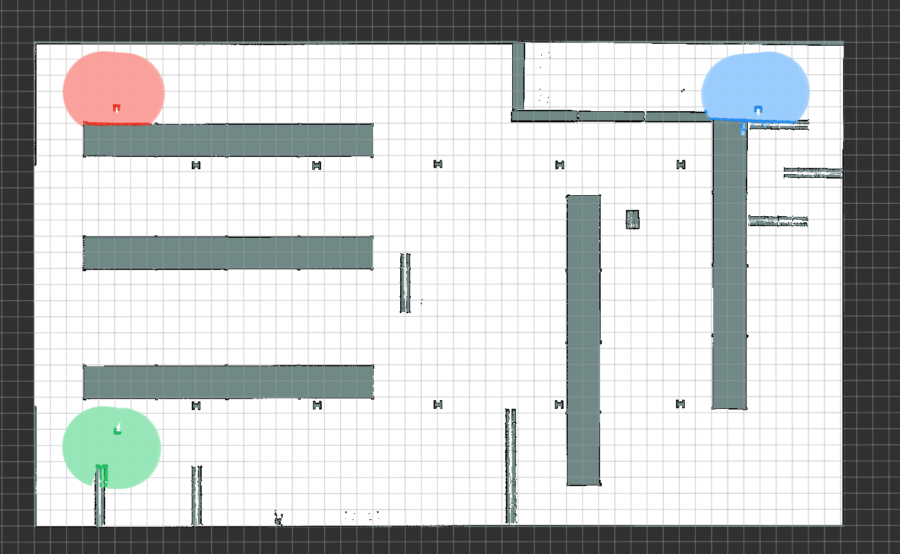

# Layered Map Server Demos

This package contains three demonstrations of the layered map server.

## TTL Smoke Test

This demo publishes a synthetic static grid and a temporary rectangle with a five-second TTL:

```bash
ros2 launch rmf_layered_map_server_demo demo.launch.py
```

Use `use_rviz:=False` for a headless run.

## Three-Robot Nav2 Observation Demo

This demo combines laser observations from three moving Nav2 robots in the global `/map`:

```bash
ros2 launch rmf_layered_map_server_demo nav2_observations.launch.py
```



By default, the demo opens three robot-local RViz windows and one combined-map view, moves the robots between fixed goals, spawns demo obstacles, and retains scans for ten seconds.

* Set `use_nav2_rviz:=False` or `use_global_rviz:=False` to disable either RViz view.
* Set `move_robots:=False` to disable robot movement.
* Set `spawn_clutter:=False` to use the unmodified warehouse world.
* Use `map` and `params_file` to override the warehouse map and shared Nav2 parameters.
* `beam_stride:=1` and `publish_period_sec:=0.5` control scan sampling.
* `max_observation_range:=2.5` and `ttl_sec:=10.0` control range and retention.

## Two-Robot Obstacle Replanning Demo

This demo connects the layered map server to the path server, plan executor, and Nav2 traffic bridge. It exercises the `CODE_PATH_BLOCKED` replanning flow from [PR #39](https://github.com/open-rmf/next_gen_prototype/pull/39).

The default scenario is a simple room with no aisles:

```bash
ros2 launch rmf_layered_map_server_demo replan_obstacle.launch.py
```

Two robots start with non-overlapping scan regions and separate goals. Once their initial plans are active, the demo spawns a red bar across both scan regions. The bar meets the right wall to form a dead end and leaves a detour around its left end.

The global RViz view shows the composed map, robot poses and goals, and Nav2 paths alongside the green RMF plans. RViz draws active per-robot obstacle cells from `/map/source_contributions` and separately shows each robot's latest free-space scan sectors.

Use the warehouse scenario to reproduce the original two-aisle case:

```bash
ros2 launch rmf_layered_map_server_demo replan_obstacle.launch.py \
  scenario:=warehouse
```

This scenario keeps the original robot poses and 15 m shelf-connected bar.

Run only one scenario per ROS/Gazebo domain because both use the same robot and map topic names. For concurrent runs, set different `ROS_DOMAIN_ID` and `GZ_PARTITION` values.

The expected sequence in the global RViz window is:

1. Both initial plans appear on the static map.
2. The long bar is spawned and its detected portions enter the combined `/map`.
3. After a 300 ms debounce, the plan executor publishes `PlanError.CODE_PATH_BLOCKED` for the blocked route.
4. The path server publishes a new plan using the updated map.

The path server conservatively downsamples the `0.1 m` simple-room map and the `0.03 m` warehouse map to its `1.0 m` PiBT planning resolution. Any planning cell containing an occupied source cell remains occupied. Replan reports have a two-second cooldown to prevent oscillation.

Useful launch arguments:

* `use_nav2_rviz:=True` opens the robot-local Nav2 views.
* `use_global_rviz:=False` runs without the combined RViz view.
* `spawn_delay_sec:=1.0` controls the delay after initial plans are received.
* `scenario_timeout_sec:=180.0` controls how long the demo waits for replanning.
* `ttl_sec` controls how long observations outside the current scan remain in the layered map. It defaults to 60 seconds for the simple scenario and 210 seconds for the warehouse scenario. New clear rays remove stale same-source obstacles before the TTL expires.
* `self_filter_radius:=0.22` excludes scan returns inside the robot body.
